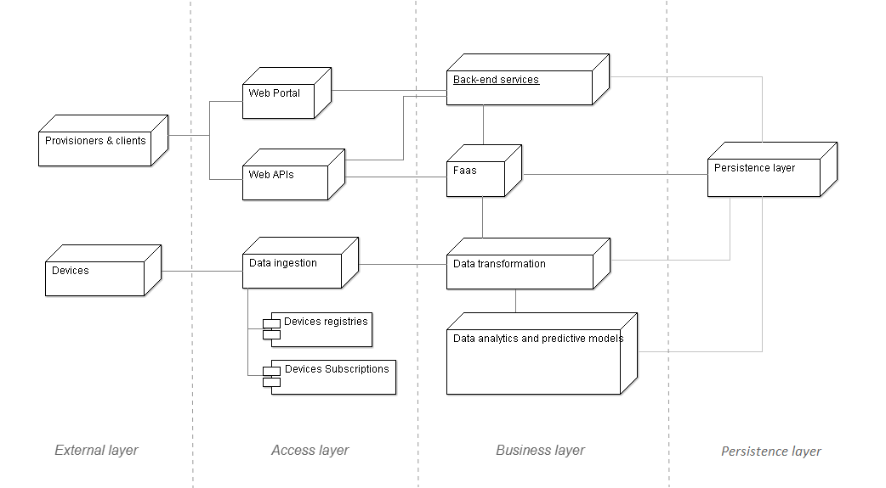
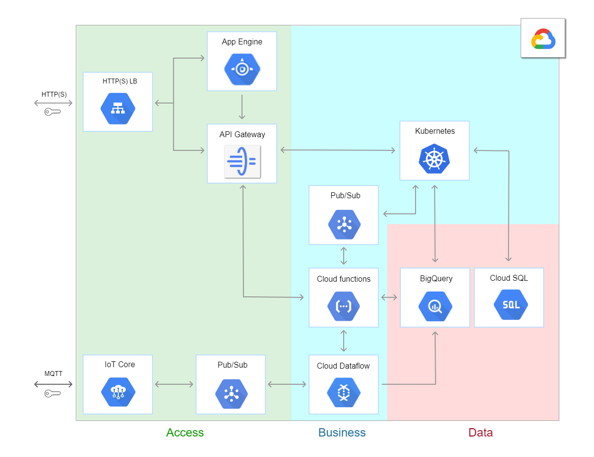

# home-devices

POC web application to manage consumers and devices entities for an IoT architecture.
The following sections describe the global acrchitecture and en example of implementation on Google Cloud.

Requirements
============

This application has been developed using:

Visual Studio 2019
.NET Core 3.1

In order to run the application docker (and docker-compose) must be installed.

It has been tested with the following versions:

Docker: version 20.10.0, build 7287ab3\
Docker-compose: 1.27.4, build 40524192

Instructions
============

In order to build and start the application run the following command:

> docker-compose build --no-cache && docker-compose up -d
 
Once started, the web service will be available at the URL **http://localhost:5050**.
Available endpoints:
 - Swagger: **http://localhost:5050/doc**
 - Metrics (Prometheus): **http://localhost:5050/metrics**
 - Health check: **http://localhost:5050/health**

\
Integration tests
=================

In order to test the application, run the following command (require .NET Core 3.1):

> dotnet test ./HomeDevice/HomeDevices.sln

\
Global architecture
===================

The selected model is compose of the following layers:

1.  **External layer**

    -   Remote devices;

    -   Clients and provisioners, that allow the users to manage,
        register and provision the devices.

2.  **Access Layer**

    -   Web Portal: allows the clients to interact with the
        platform using a web application;

    -   Web APIs: allows to the clients, provisioners and
        WebPortal to interact with the business layer;

    -   Data ingestion and devices management: represents the
        interaction between the remote devices and the back-end
        layer, that forwards the data between the remote devices and
        to the business layer.

3.  **Business and data layer**

    -   Data transformation: it is in charge of adapting and
        transforming the data coming from the devices before storing
        them or before forwarding them to the server-less functions.

    -   Faas: server-less functions that can be created ad
        hoc to perform custom task on stream data

    -   Data analytics and predictive models: back-end
        services that analyze devices and platform data in order to
        provide features based on AI, predictive models and metrics
        related to the remote devices.

    -   Persistence layer: it's composed of a NoSQL database
        to store IoT information related to the streams coming the
        remote devices and a relational database to manage the
        registry of the devices, tenants and consumers.

    -   Custom back-end services: represents a cluster of
        nodes of custom services that can be used for custom tasks
        such as exposing the APIs to interact with the databases,
        analytics and metrics.

**Deployment diagram** of the described architecture:

\
Implementation on Google Cloud Platform
=======================================

1.  **Access layer**

    The access layer secures the external connections provides
    data ingestion and platform configuration:

    -   **HTTP(S) LB**: this is the load balancer, it's important to
        balance the load while accessing to the web portal or web
        APIs.

    -   **App Engine**: web portal hosting service

    -   **API Gateway**: groups and exposes the available Web APIs

    -   **IoT Core**: service that allows connect, manage, and
        ingest data from remote devices

    -   **Pub/Sub**: service that is in charge of handling devices'
        publishers and subscriptions
\

2.  **Business layer**

    The business layer manages devices' data transformation, server-less
    functions, services' subscriptions and platform custom services:

    -   **Cloud Dataflow**: devices' stream data analytics and
        transformation;

    -   **Cloud Functions**: custom server-less functions that execute
        context specific tasks collaborating with databases, device's stream
        and custom services available in the Kubernetes cluster;

    -   **Pub/Sub**: provides decoupling to execute asynchronous tasks with
        the data coming from server-less functions or Kubernetes services;

    -   **Kubernetes**: represents a cluster of nodes that can be used for
        custom services scheduling, scaling and interaction.

3.  **Data layer**

    The data layer is responsible for data storing and retrieving, and
    it's composed by the following modules:

    -   **BigQuery**: high throughput NoSQL database used to store devices'
        data in order to make them available for offline data analytics or
        services based on deep learning;

    -   **Cloud SQL**: relational database (PostgreSQL) used to store and
        retrieve consumers, devices or tenants data.

Diagram of the illustrated architecture on GCP:

